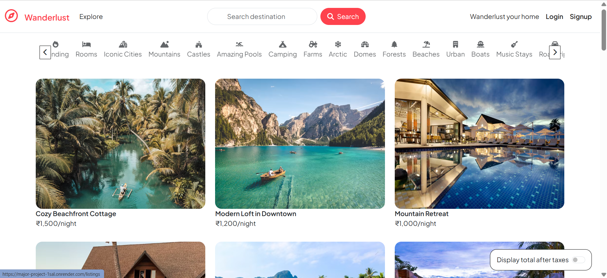
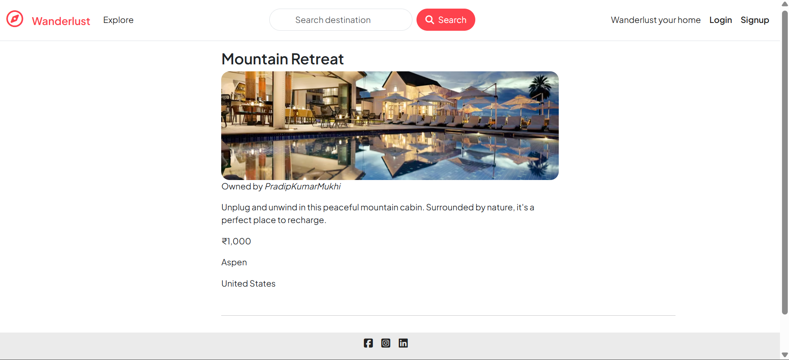

# 🚀 Major Project — Full Stack Web Application

An advanced web application built with the **MERN-like stack** (MongoDB, Express, Node.js, HTML/CSS/JS) that demonstrates seamless user experience, robust backend logic, and organized architecture.

---

## ✨ Project Highlights

- 🎨 **Frontend**: Developed using **HTML**, **CSS**, **JavaScript**, and **Bootstrap** to ensure a responsive and engaging user interface.
- 🔧 **Backend**: Powered by **Node.js** and **Express.js**, handling API routes and business logic.
- 🧱 **MVC Architecture**: Implemented for a clean, modular, and scalable codebase.
- 🔐 **Session Management**: Secure user sessions using **Express Sessions** and **Web Cookies**.
- 🔔 **Flash Messages**: Used for real-time user notifications and feedback.
- ☁️ **Cloud Database**: Integrated with **MongoDB Atlas** for efficient data storage and retrieval.
- 🔑 **Authentication & Authorization**: Custom user login system with access control.
- 🗂️ **CRUD Operations**: Full Create, Read, Update, and Delete functionality for seamless data management.
- ⚠️ **Error Handling**: Robust handling and user-friendly error responses.

---

## 🖥️ Tech Stack

| Layer       | Technology                            |
|-------------|----------------------------------------|
| Frontend    | HTML5, CSS3, JavaScript, Bootstrap     |
| Backend     | Node.js, Express.js                    |
| Database    | MongoDB Atlas                          |
| Auth & Sess | Express-Session, Cookies, Flash Msgs   |
| Architecture| MVC Pattern                            |

---

## 📁 Project Structure

```bash
MAJOR_PROJECT/
├── controllers/       # Handles route logic
├── models/            # Mongoose schemas
├── public/            # Static assets (CSS, JS, images)
├── routes/            # Express route definitions
├── utils/             # Helper utilities
├── views/             # EJS templates for rendering pages
├── app.js             # Main server file
├── cloudConfig.js     # Cloudinary / storage config
├── middleware.js      # Auth & error handling
├── schema.js          # MongoDB schemas
└── package.json       # Project dependencies
```
---

## 📸 Screenshots
## 🏠 Homepage Overview

The homepage of **Wanderlust** is designed to offer a seamless and visually appealing browsing experience for users seeking unique stays around the world.
### 🔑 Key Features:
- 🔍 **Search Bar**: Easily search for destinations.
- 🏷️ **Category Slider**: Explore properties by categories like Mountains, Castles, Forests, Beaches, and more.
- 🏡 **Listings Grid**: Displays accommodation cards with images, names, and nightly rates.
- 📱 **Responsive UI**: Works beautifully across devices for optimal user experience.

---

## 📄 Individual Listing Page

Each listing page provides in-depth details about a specific property to help users make informed booking decisions.

### 🔑 Key Features:
- 🖼️ **Large Cover Image**: Gives a visual impression of the property.
- 🙍 **Owner Name**: Listed for credibility.
- 📝 **Detailed Description**: Helps users understand what makes the stay special.
- 💰 **Price Info**: Clearly displayed per-night cost.
- 🌍 **Location Info**: City and country of the listing.



## 🙋‍♂️ Connect with Me

- 💼 [LinkedIn Profile](https://www.linkedin.com/in/pradip-kumar-mukhi-416b33249/)
- 📧 Email: pradipofficial462@gmail.com
